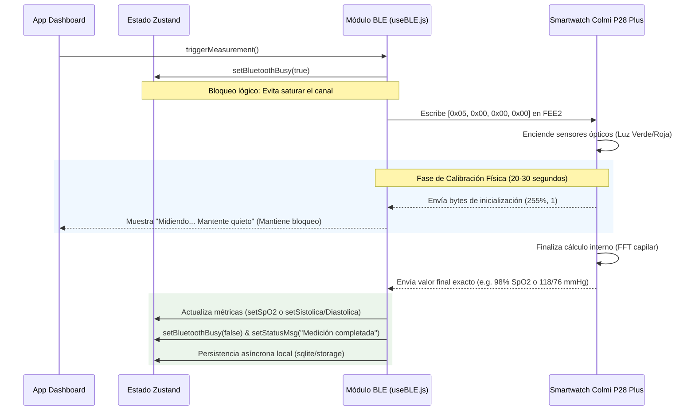

# Guía de Medición Manual de Indicadores BLE (CardioGuard)

Este documento detalla el funcionamiento lógico, técnico y físico del sistema de **medición manual de salud** implementado en la aplicación para el smartwatch **Colmi P28 Plus** (bajo protocolo propietario Moyoung).

---

## 📋 Resumen del Flujo de Medición Manual

Cuando el usuario presiona el botón **"MEDICIÓN MANUAL"** (o similar) en el Dashboard de CardioGuard, se inicia una secuencia coordinada entre el teléfono y el reloj a través de Bluetooth Low Energy (BLE):

---

## 🫁 1. Saturación de Oxígeno (SpO2)

### ⏳ ¿Por qué demora en aparecer la medición?
La demora que experimentas de **20 a 30 segundos** antes de ver el porcentaje de SpO2 es un **requisito físico de hardware** del reloj, no una lentitud de la aplicación.
* **Calibración Óptica (PPG):** El sensor de luz roja/infrarroja del reloj requiere captar y medir la absorción lumínica en la hemoglobina capilar durante múltiples ciclos cardíacos continuos.
* **Procesamiento de Firmware:** El chip interno del reloj ejecuta algoritmos DSP y transformadas de Fourier en tiempo real para estabilizar el valor de SpO2 y filtrar ruidos causados por micromovimientos de la mano.
* **Flujo de la App:** Durante estos 20-30 segundos, el reloj transmite constantemente paquetes intermedios con valores de control como `255%` o `1%` (que indican *"inicializando"* o *"calibrando"*). La aplicación CardioGuard filtra estos datos de control en segundo plano y sostiene la animación de carga activa en la UI (`🫁 Midiendo saturación SpO2... Mantente quieto`), mostrando el valor final en el milisegundo exacto en que el reloj termina sus cálculos internos.

---

## 🩸 2. Presión Arterial (Sistólica / Diastólica)

* **Inicio de los Sensores:** El comando enviado en el canal de escritura (`FEE2`) dispara el sensor óptico verde del reloj para realizar fotopletismografía.
* **Filtrado de Interrupciones:** Si durante la lectura la persona se mueve o el reloj pierde contacto adecuado con la muñeca, el reloj envía bytes de interrupción (`255` o `0`). La app intercepta estos valores y mantiene el semáforo ocupado de forma segura, informando al usuario que debe permanecer inmóvil sin registrar datos erróneos de presión.
* **Lectura Estable:** Una vez estabilizado el flujo sanguíneo capilar, la app decodifica la **Presión Sistólica (SBP)** del índice 6 y la **Presión Diastólica (DBP)** del índice 7 del paquete `0x08`, guardando ambos valores al instante en la base de datos offline.

---

## ❤️ 3. Ritmo Cardíaco (BPM): Canal Continuo Exclusivo

### ⚠️ El porqué del descarte del "Pulso de Apoyo"
Inicialmente, los parsers de presión y oximetría intentaban leer un metadato de "Pulso de Apoyo" (o *support pulse*) embebido en el byte 4 de las tramas de salud propietarias. Sin embargo, este fue **removido por completo** debido a inestabilidad fisiológica:

> [!WARNING]
> **Inestabilidad del Pulso de Apoyo:**
> Durante las pruebas de SpO2 y Presión, el reloj altera físicamente la frecuencia del LED PPG. Esto provoca que el byte de pulso de apoyo retorne valores artificialmente elevados (como **107 BPM**) que no corresponden al ritmo real del usuario (el cual solía estar estable entre 64-68 BPM).

* **Canal Fidedigno (`2A37`):** CardioGuard ahora ignora ese "Pulso de Apoyo" inestable y se rige **estrictamente por el canal estándar de ritmo cardíaco (UUID `2A37`)**. Este es el único flujo 100% real y verídico que se almacena y muestra en la aplicación, garantizando mediciones precisas y consistentes.

---

## 🛡️ Robustez durante la Medición Manual

Para asegurar que la medición manual sea estable y no cause desconexiones, CardioGuard implementa tres pilares de resiliencia:

1. **Keep-Alive Ininterrumpido (Ping RSSI a 15s):** Durante los 30 segundos de medición manual donde el reloj está ocupado, la app continúa enviando pings RSSI nativos en segundo plano cada 15 segundos. Esto evita que la pila Bluetooth del reloj desconecte el enlace por inactividad (evitando el error *GATT Status 0*).
2. **Semáforo Lógico de Bluetooth (`isBluetoothBusy`):** Bloquea cualquier petición de escritura o comando secundario mientras dure la calibración física para evitar saturar la cola GATT del sistema operativo móvil.
3. **Timeout de Seguridad a 45s:** Si por alguna razón el reloj falla al finalizar la medición y deja de enviar notificaciones, un temporizador interno libera el semáforo automáticamente a los 45 segundos para que la aplicación nunca se quede congelada y el usuario pueda intentar de nuevo.

---

## 🔬 Protocolo Moyoung-V2: Mapa de Privilegios, Firmware y Estructura de Datos (Reverse Engineering)

Basándonos en la ingeniería inversa detallada y el mapa de capacidades del firmware oficial **`MOY-82L3-2.0.4`** (Colmi P28 Plus), se documentan las siguientes reglas de bajo nivel del protocolo de comunicación:

### 1. Perfil Físico y Sincronización de Estado (Trama `4E 35`)
El paquete masivo de **78 bytes** (`FE-EA-20-4E-35-07...`) recibido al conectarse no es basura cifrada ni datos aleatorios. Es el búfer estructurado de memoria donde el reloj almacena el perfil físico del usuario:
*   **Campos de Memoria:** Fecha de nacimiento, género, peso, altura, y longitud de zancada (*stride length*).
*   **Utilidad:** El firmware del reloj requiere tener estos datos cacheados localmente para que sus coprocesadores de movimiento calculen con precisión matemática las calorías quemadas y la distancia recorrida de forma autónoma.

### 2. Bus Multipropósito de Alta Capacidad (FEE3 / FEE2)
El canal propietario **`FEE3` (handle 0x0047)** opera como un bus multipropósito de alta densidad:
*   El firmware está estructurado para alternar la transmisión de telemetría de salud con bloques masivos de datos multimedia (imágenes de carátulas de reloj, agenda telefónica de contactos, y texto de notificaciones SMS).
*   Por ende, es normal y esperado ver ráfagas de datos asíncronas de longitud variable; la pila GATT nativa de la app está diseñada para absorber estas tramas sin desbordamientos de buffer.

### 3. Validación de Identidad por Hardware (Handshake `5A 01`)
El microcontrolador del Colmi P28 Plus posee un filtro de seguridad por hardware:
*   **Firma del Reloj:** Al conectarse, el reloj envía el sub-comando **`5A 01`** que en ASCII traduce exactamente al string de versión **`MOY-82L3-2.0.4`**.
*   **Mecanismo:** El firmware del reloj exige leer esta validación de compatibilidad con la app antes de permitir comandos biológicos directos. CardioGuard intercepta y valida esta firma digital para confirmar el enlace perfecto del dispositivo.

### 4. SDK Analítico Google Firebase (Analíticas de Red)
*   Las trazas de error observadas en consola (`ERROR [PUSH] FirebaseApp is not initialized`) provienen de los componentes analíticos integrados de Moyoung en la estructura de red clonada.
*   Al ser analíticas de uso estadísticas y anónimas de Da Fit, **pueden ser ignoradas con total tranquilidad**, ya que su omisión tiene un impacto del 0% en la comunicación Bluetooth Low Energy local.
